# Introduction

This is an analysis of the RINT presence-only data gathered by the [MOm NGO](http://www.mom.gr/homepage.asp?ITMID=101&LANG=EN) through a citizen-science program. The objective is to map the distribution of monk seals by fitting occupancy models to these data. 

Load all the packages we will need. 

```r
library(tidyverse)
library(lubridate)
theme_set(theme_light())
library(sf)
library(viridis)
library(gridExtra)
library(transformr)
library(here)
```

# Exploratory data analyses

Let's load and explore the data to get a feeling of the info we have (and we do not have). 

```r
load(here::here("data","monseal.RData"))
```

First, the number of sightings over time.

```r
monkseal %>% 
  ggplot() +
  aes(x = year) + 
  geom_bar()
```

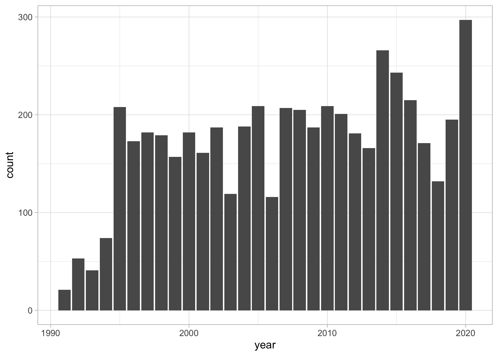<!-- -->

The sightings are done along the year (all years are pooled together). August gets maximum sightings.

```r
monkseal %>% 
  ggplot() +
  aes(x = factor(month)) + 
  geom_bar() + 
  xlab('month')
```

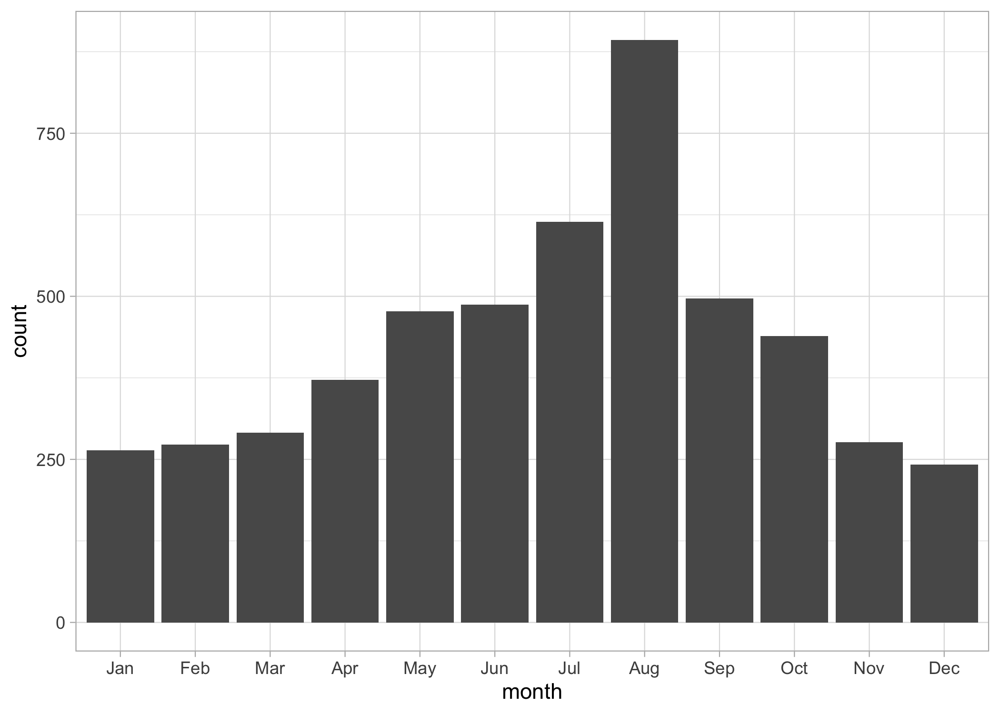<!-- -->

Regarding observers, sightings are mostly done by local people, then to a lesser extent tourists, spear gun fishers, professional fishermen and sailmen, port police and a few others. 

```r
monkseal %>% 
  filter(!is.na(observer)) %>%
  count(observer) %>%
  ggplot() +
  aes(x = n, y = fct_reorder(observer, n)) %>%
  geom_col() +
  labs(x = NULL, y = NULL)
```

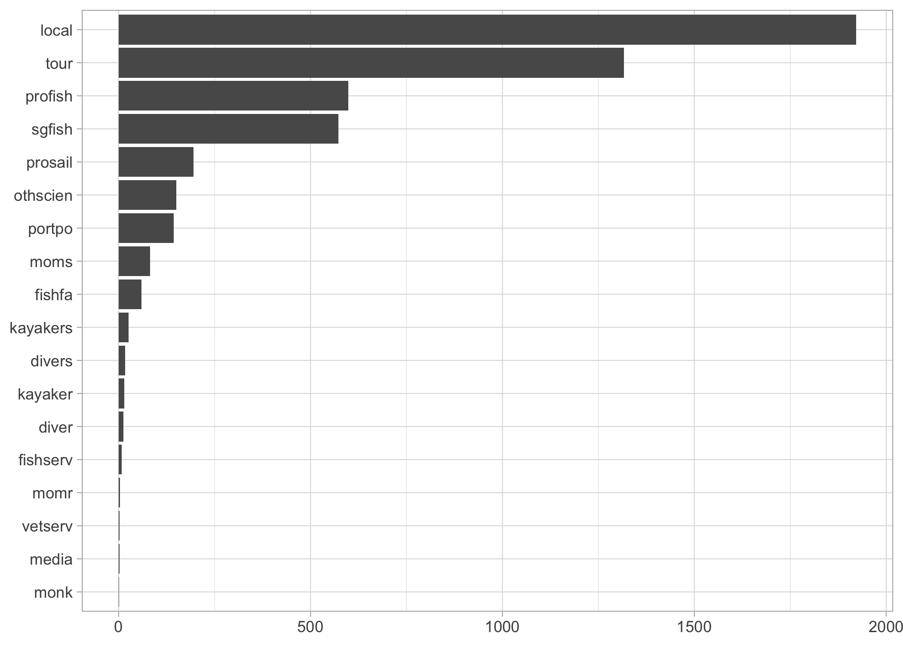<!-- -->

Last, regarding where the seals were when they were spotted, we see that the sightings are mostly at sea (h), from human settlement (i) and on beach (f). 

```r
monkseal %>% 
  filter(!is.na(where)) %>%
  count(where) %>%
  ggplot() +
  aes(x = n, y = fct_reorder(where, n)) %>%
  geom_col() +
  labs(x = NULL, y = NULL) 
```

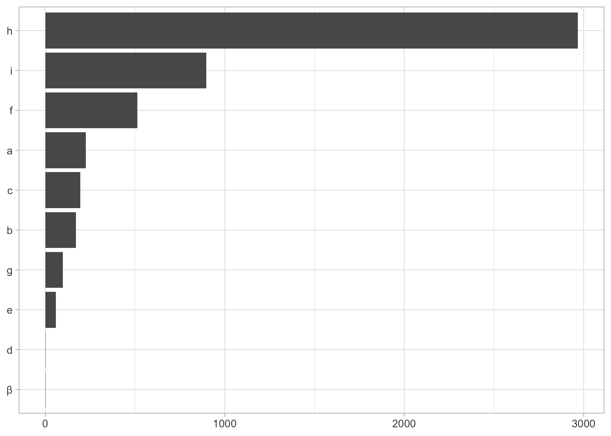<!-- -->

# Data mapping

Before diving deep into the statistical analyses, let's put the sightings on a map. 

First, let's get a map of Greece.

```r
greece <- st_read(here::here("shapefiles","greece.shp"))
```

```
## Reading layer `greece' from data source 
##   `/Users/oliviergimenez/Dropbox/OG/GITHUB/monkseal-occupancy/shapefiles/greece.shp' 
##   using driver `ESRI Shapefile'
## replacing null geometries with empty geometries
## Simple feature collection with 10072 features and 3 fields (with 9735 geometries empty)
## Geometry type: GEOMETRY
## Dimension:     XY
## Bounding box:  xmin: 104110.2 ymin: 3850806 xmax: 1007943 ymax: 4623933
## Projected CRS: GGRS87 / Greek Grid
```

```r
coastlines <- st_read(here::here("shapefiles","coastlines.shp"))
```

```
## Reading layer `coastlines' from data source 
##   `/Users/oliviergimenez/Dropbox/OG/GITHUB/monkseal-occupancy/shapefiles/coastlines.shp' 
##   using driver `ESRI Shapefile'
## Simple feature collection with 3350 features and 1 field
## Geometry type: LINESTRING
## Dimension:     XY
## Bounding box:  xmin: 104130.9 ymin: 3850438 xmax: 1007943 ymax: 4539200
## Projected CRS: GGRS87 / Greek Grid
```

```r
ggplot() + 
  geom_sf(data = greece) + 
  geom_sf(data = coastlines, color = 'red') + 
  labs(title = 'Map of Greece and coastlines', x = NULL, y = NULL)
```

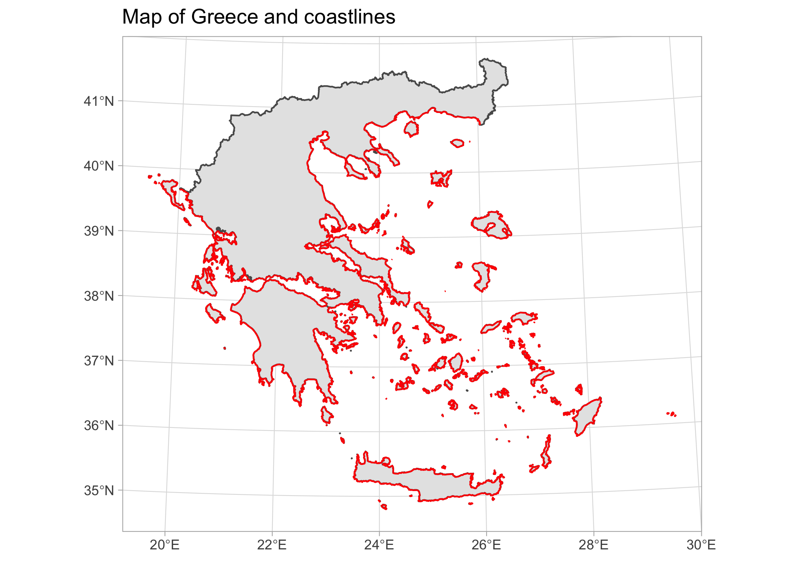<!-- -->

And our grid (including a 20-km buffer around coastlines).

```r
grid <- st_read(here::here("shapefiles","grid.shp"))
```

```
## Reading layer `grid' from data source 
##   `/Users/oliviergimenez/Dropbox/OG/GITHUB/monkseal-occupancy/shapefiles/grid.shp' 
##   using driver `ESRI Shapefile'
## Simple feature collection with 3016 features and 10 fields
## Geometry type: MULTIPOLYGON
## Dimension:     XY
## Bounding box:  xmin: 99323.68 ymin: 3841064 xmax: 1010706 ymax: 4559199
## Projected CRS: GGRS87 / Greek Grid
```

```r
ggplot() + 
  geom_sf(data = greece) + 
  geom_sf(data = grid, lwd = 0.1) + 
  labs(title = 'Gridded map of Greece', x = NULL, y = NULL)
```

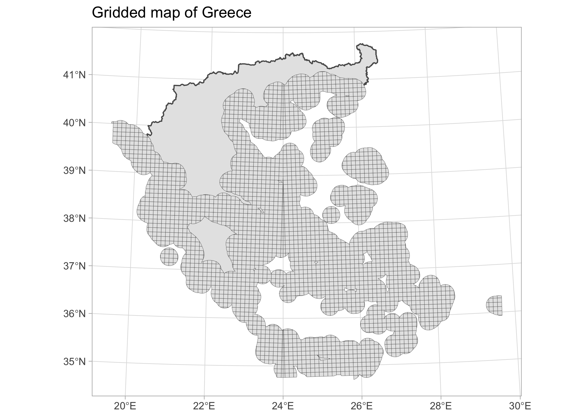<!-- -->

Note that a few sites are small, more precisely 0 percent of the 3016 (i.e. 166 sites) are less than $10km^2$.

Get all sightings and map them:

```r
counts <- monkseal %>%
  group_by(utm) %>%
  count()
names(counts) <- c('UTM_NAME','val')
grid_wcounts <- right_join(grid, counts)
classes <- classInt::classIntervals(grid_wcounts$val, n = 5, style = "jenks")
bwr <- grDevices::colorRampPalette(rev(c('red', 'orange', 'yellow', 'cyan', 'blue')))
grid_wcounts <- grid_wcounts %>%
  mutate(valdiscrete = cut(val, classes$brks, include.lowest = T))
ggplot() + 
  geom_sf(data = greece, colour = "grey50", fill = "white") + 
  geom_sf(data = grid, colour = "grey50", fill = "white", lwd = 0.1) + 
  geom_sf(data = grid_wcounts, lwd = 0.1, aes(fill = valdiscrete)) + 
  geom_sf(data = greece, colour = "grey50", fill = "white",lwd = 0.2) + 
  scale_fill_manual(
    name = 'counts',
    values = bwr(5),
    guide = guide_legend(reverse = TRUE)) + 
  labs(title = '', x = NULL, y = NULL)
```

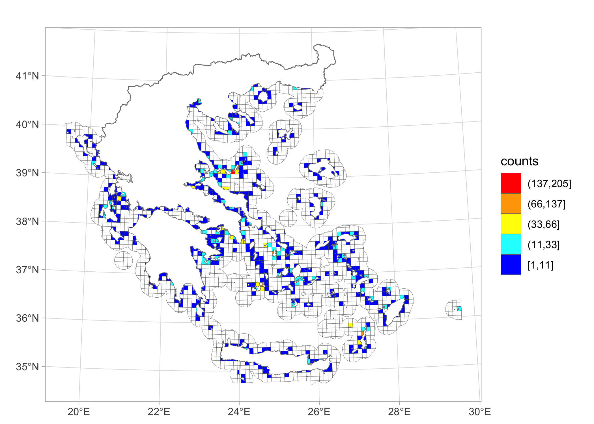<!-- -->

```r
ggsave(here::here("figures","map1.png"), dpi = 600)
```

# Occupancy analysis

## Data formating

Prepare the data:

```r
grid <- grid %>% 
  filter(as.numeric(areakm2)>10) # filter out small sites
mm <- c('Mar','Apr','May','Jun','Jul','Aug','Sep','Oct') # extract month with data
indyear <- c(2000:2007, 2013:2020) # define two periods
ids <- unique(grid$UTM_NAME)
mom_detections <- list()
for (k in 1:length(indyear)){
  mom_detections[[k]] <- matrix(0,nrow=length(ids),ncol=length(mm))
  data <- filter(monkseal,year==indyear[k])
  ind <- 1
  for (i in mm){
    temp <- filter(data, month==i)
    utm_temp <- unique(temp$utm)
    for (j in utm_temp){
      # 1 if a sighting was made in square j in month i
      mom_detections[[k]][ids==j,ind] <- 1
    }
    ind <- ind + 1
  }
}
mom_det <- do.call(cbind, mom_detections) # bind data from all year in columns
# convert the occupancy dataset in a 3D array:
y <- list()
ind <- 0
for (i in 1:length(indyear)){
	mask <- (ind + i):(ind + i + length(mm) - 1)
	y[[i]] <- mom_det[,mask]
	ind <- ind + length(mm) - 1
}

# convert list into array (https://stackoverflow.com/questions/37433509/convert-list-to-a-matrix-or-array)
y <- array(unlist(y), dim = c(nrow(y[[1]]), ncol(y[[1]]), length(y)))
dim(y)
```

```
## [1] 2850    8   16
```

Now we reformat the data as follows: first, for each year, we determine whether the species was ever detected or not; then for each period, we count the number of times the species was detected:

```r
new_y <- NULL
for (i in 1:dim(y)[3]){ # loop over years
  new_y <- cbind(new_y,apply(y[,1:8,i],1,sum))
}
new_y <- (new_y > 0) 
y1 <- apply(new_y[,1:8],1,sum)
y2 <- apply(new_y[,9:16],1,sum)
y <- cbind(y1,y2)
dim(y)
```

```
## [1] 2850    2
```

```r
range(y)
```

```
## [1] 0 8
```

## Inference

Load `nimble` package:

```r
library(nimble)
```

We specify our model:

```r
model <- nimbleCode({

  # occupancy
  mupsi ~ dnorm(-5,sd = 1)
  for(i in 1:nsite){
    cloglog(psi[i]) <- mupsi + offset[i]
  }

  # detection
  sdp ~ dunif(0,10)
  for(i in 1:nyear){
    muptemp[i] ~ dunif(0,1)
    logit(mup[i]) <- muptemp[i]
  }
  for(i in 1:nsite){
    lp[i] ~ dnorm(0, sd = sdp)
    for(t in 1:nyear){
      logit(p[i,t]) <- mup[t] + lp[i]
    }
  }
  
  # priors for mean extinction/colonization
  mueps ~ dnorm(-5, sd = 1)
  mugam ~ dnorm(-5, sd = 1)
  
  # process model
  for(i in 1:nsite){
    z[i,1] ~ dbern(psi[i])
    cloglog(gamma[i]) <- mugam + offset[i]
    cloglog(eps[i]) <- mueps + offset[i]
    z[i,2] ~ dbern(z[i,1] * (1 - eps[i]) + (1 - z[i,1]) * gamma[i])
  }
  
  # observation model
  for (i in 1:nsite){
    for (k in 1:nyear){
      y[i,k] ~ dbin(z[i,k] * p[i,k],8)
    }
  }
})
```

Specify data, initial values, parameters to be monitored and various MCMC details:

```r
# data
offset <- log(as.numeric(grid$areakm2))
win.data <- list(y = y)
win.constants <- list(nsite = dim(y)[1], 
                      nyear = dim(y)[2], 
                      offset = offset)

# initial values
zst <- cbind(as.numeric(y1 > 0), as.numeric(y2 > 0)) # observed occurrence as inits for z 
inits <- function() {list(z = zst, 
                          mueps = -4, 
                          mugam = -4, 
                          mupsi = -4,
                          sdp = runif(1,1,9), 
                          muptemp = rep(0,dim(y)[1]),
                          eps = rep(0.5,dim(y)[1]),
                          gamma = rep(0.5,dim(y)[1]),
                          psi = rep(0.5,dim(y)[1]),
                          lp = rep(0,dim(y)[1]),
                          mup = rep(0,dim(y)[2]))}

# MCMC settings
ni <- 15000
nb <- 5000
nc <- 2
```

Create model as a R object: 

```r
survival <- nimbleModel(code = model,
                        data = win.data,
                        constants = win.constants,
                        inits = inits(),
                        calculate = FALSE)
#survival$initializeInfo()
#survival$calculate()
```

Go through `nimble` workflow:

```r
# compile model
Csurvival <- compileNimble(survival)

# create a MCMC configuration
survivalConf <- configureMCMC(survival, 
                              useConjugacy = FALSE)
```

```
## ===== Monitors =====
## thin = 1: mupsi, sdp, muptemp, mueps, mugam
## ===== Samplers =====
## RW sampler (2856)
##   - mupsi
##   - sdp
##   - muptemp[]  (2 elements)
##   - mueps
##   - mugam
##   - lp[]  (2850 elements)
## binary sampler (5700)
##   - z[]  (5700 elements)
```

```r
# replace RW samplers by slice sampler for standard deviation of random effects on detection
survivalConf$removeSamplers(c('sdp'))
survivalConf$addSampler(target = c('sdp'),
                        type = 'slice')

# add some parameters to monitor
survivalConf$addMonitors(c("lp","z","mupsi","mup"))
```

```
## thin = 1: mupsi, sdp, muptemp, mueps, mugam, lp, z, mup
```

```r
# create MCMC function and compile it
survivalMCMC <- buildMCMC(survivalConf)
CsurvivalMCMC <- compileNimble(survivalMCMC, project = survival)
```

Run `nimble`:

```r
ptm <- proc.time()
out <- runMCMC(mcmc = CsurvivalMCMC, 
               niter = ni,
               nburnin = nb,
               nchains = nc)
```

```
## |-------------|-------------|-------------|-------------|
## |-------------------------------------------------------|
## |-------------|-------------|-------------|-------------|
## |-------------------------------------------------------|
```

```r
x <- proc.time() -  ptm
save(out, x, file = here::here("models","monksealscloglog-nimble.RData"))
```

The code above takes some time to run. I ran it, saved the results and use them from here:

```r
load(here::here("models","monksealscloglog-nimble.RData"))
out_backup <- out
```

Check convergence:

```r
library(MCMCvis)
MCMCtrace(object = out,
          pdf = FALSE,
          ind = TRUE,
          Rhat = TRUE, # add Rhat
          n.eff = TRUE, # add eff sample size
          params = c("mupsi","sdp",
                     "mup","mugam","mueps"))
```

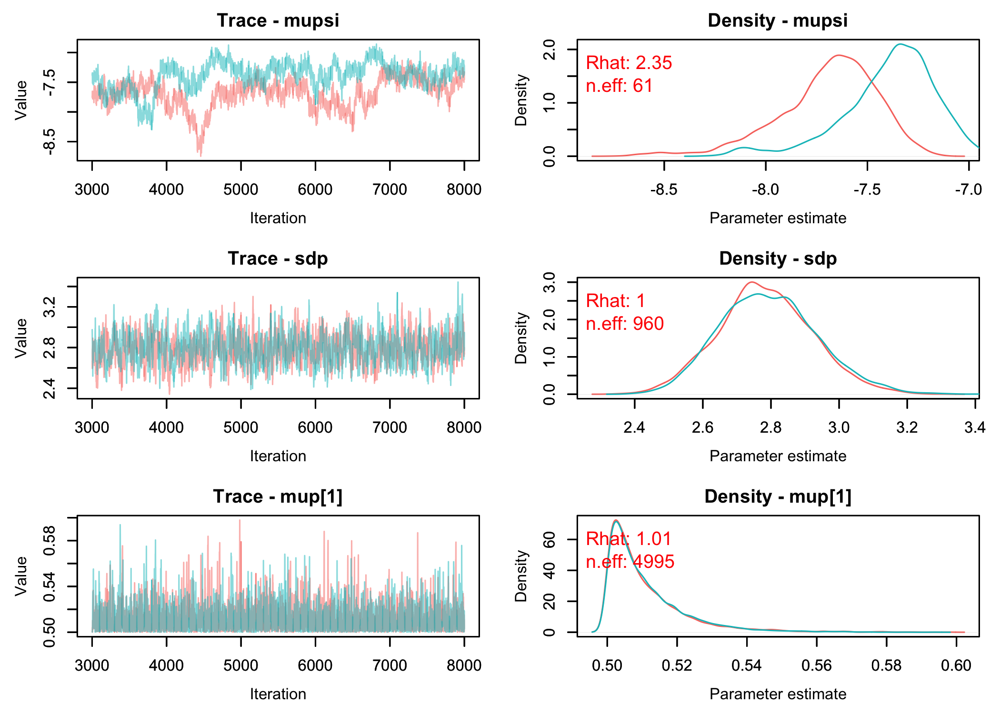<!-- -->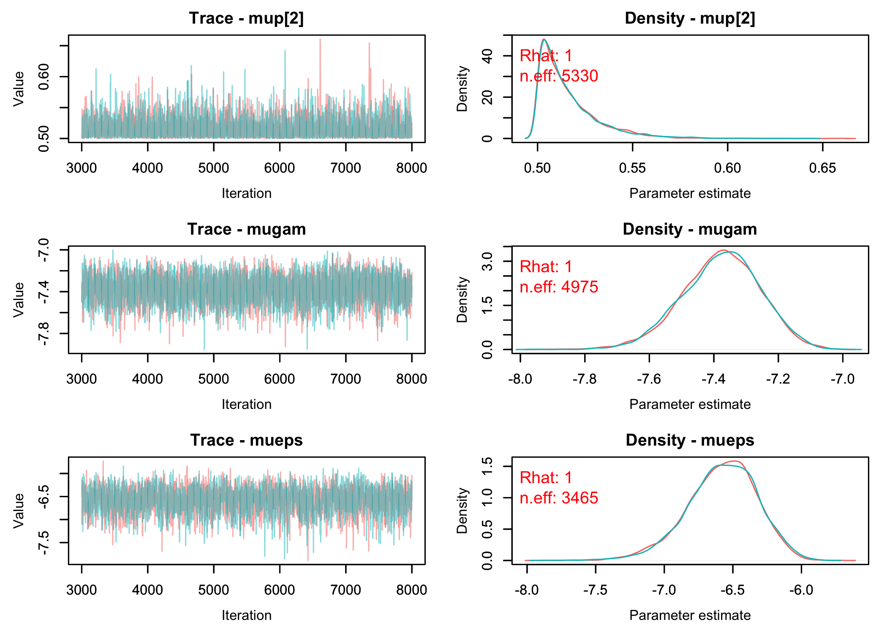<!-- -->

Print results:

```r
out <- rbind(out$chain1, out$chain2)
out %>%
  as_tibble() %>%
  pivot_longer(cols = everything(),  values_to = "value", names_to = "parameter") %>%
  filter(str_detect(parameter, "mu") | str_detect(parameter, "sd")) %>%
  filter(str_detect(parameter, "muptemp", negate = TRUE)) %>%
  group_by(parameter) %>%
  summarize(median = median(value),
            lci = quantile(value, probs = 2.5/100),
            uci = quantile(value, probs = 97.5/100))
```

<div data-pagedtable="false">
  <script data-pagedtable-source type="application/json">
{"columns":[{"label":["parameter"],"name":[1],"type":["chr"],"align":["left"]},{"label":["median"],"name":[2],"type":["dbl"],"align":["right"]},{"label":["lci"],"name":[3],"type":["dbl"],"align":["right"]},{"label":["uci"],"name":[4],"type":["dbl"],"align":["right"]}],"data":[{"1":"mueps","2":"-6.5020375","3":"-7.0600304","4":"-6.0781270"},{"1":"mugam","2":"-7.3147531","3":"-7.5739128","4":"-7.0984725"},{"1":"mup[1]","2":"0.5077458","3":"0.5002912","4":"0.5392629"},{"1":"mup[2]","2":"0.5101686","3":"0.5003561","4":"0.5539838"},{"1":"mupsi","2":"-6.4137671","3":"-6.5354151","4":"-6.2886941"},{"1":"sdp","2":"2.7750334","3":"2.5463384","4":"3.0767649"}],"options":{"columns":{"min":{},"max":[10]},"rows":{"min":[10],"max":[10]},"pages":{}}}
  </script>
</div>

## Post-process results

Check out the number of occupied UTM squares by the species over time. First work out the naive occupancy, that is the number of sites that were observed occupied over the two periods:

```r
naiveocc <- rep(NA,2) 
for (i in 1:2){
  naiveocc[i] <- sum(y[,i]>0)
}
naiveocc
```

```
## [1] 271 343
```

Now the estimated occupancy:

```r
zzz <- out[,grepl("z", colnames(out))]
zz <- array(NA, dim = c(nrow(zzz), ncol(zzz)/2, 2))
zz[,,1] <- zzz[1:nrow(zzz),1:(ncol(zzz)/2)]
zz[,,2] <- zzz[1:nrow(zzz),(ncol(zzz)/2+1):ncol(zzz)]
dim(zz) # 2000 x 2850 x 2 (nbMCMC x nSquares x nyears)
```

```
## [1] 20000  2850     2
```

```r
nbpixocc <- apply(zz,c(1,3),sum) # 2000 x 2
meannbpixocc <- apply(nbpixocc,2,median)
sdnbpixocc <- apply(nbpixocc,2,sd)
qulnbpixocc <- apply(nbpixocc,2,quantile,probs=2.5/100)
quunbpixocc <- apply(nbpixocc,2,quantile,probs=97.5/100)
```

Put everything together:

```r
occupancy <- data.frame(period = c(1,2),
  naiveocc = naiveocc, 
  medianocc = meannbpixocc,
  qulnbpixocc = qulnbpixocc,
  quunbpixocc = quunbpixocc)
occupancy2 <- data.frame(period = rep(c(1,2),2),
  occ = c(occupancy$naiveocc, occupancy$medianocc), 
  quantlower = c(rep(NA,2),occupancy$qulnbpixocc),
  quantupper = c(rep(NA,2), occupancy$quunbpixocc),
  Occupancy = c(rep('naive',2),rep('estimated',2)))
occupancy2
```

<div data-pagedtable="false">
  <script data-pagedtable-source type="application/json">
{"columns":[{"label":["period"],"name":[1],"type":["dbl"],"align":["right"]},{"label":["occ"],"name":[2],"type":["dbl"],"align":["right"]},{"label":["quantlower"],"name":[3],"type":["dbl"],"align":["right"]},{"label":["quantupper"],"name":[4],"type":["dbl"],"align":["right"]},{"label":["Occupancy"],"name":[5],"type":["chr"],"align":["left"]}],"data":[{"1":"1","2":"271","3":"NA","4":"NA","5":"naive"},{"1":"2","2":"343","3":"NA","4":"NA","5":"naive"},{"1":"1","2":"380","3":"356","4":"409","5":"estimated"},{"1":"2","2":"466","3":"441","4":"493","5":"estimated"}],"options":{"columns":{"min":{},"max":[10]},"rows":{"min":[10],"max":[10]},"pages":{}}}
  </script>
</div>

Now plot:

```r
occupancy2 %>% 
  ggplot() + 
  aes(x = period, y = occ, group = Occupancy, linetype = Occupancy) + 
  geom_ribbon(data = occupancy2,
              aes(ymin = quantlower, ymax = quantupper),
              alpha = 0.1, 
              show.legend = FALSE) + 
  geom_line() +
  scale_linetype_manual(values = c("solid", "dashed")) +  
  geom_point() + 
  labs(x = 'Year', y = 'Number of occupied sites')
```

<!-- -->

Now display local extinction, colonization and species detection probabilities estimates with credible intervals:

```r
epsmean <- icloglog(mean(out[,'mueps']) + mean(offset))
epsql <- icloglog(mean(out[,'mueps']) + mean(offset) - 2*sd(out[,'mueps']))
epsqu <- icloglog(mean(out[,'mueps']) + mean(offset) + 2*sd(out[,'mueps']))

gammean <- icloglog(mean(out[,'mugam']) + mean(offset))
gamql <- icloglog(mean(out[,'mugam']) + mean(offset) - 2*sd(out[,'mugam']))
gamqu <- icloglog(mean(out[,'mugam']) + mean(offset) + 2*sd(out[,'mugam']))

pmean1 <- plogis(mean(out[,'mup[1]']))
pmean2 <- plogis(mean(out[,'mup[2]']))
pqu1 <- plogis(mean(out[,'mup[1]']) + 2*sd(out[,'mup[1]']))
pql1 <- plogis(mean(out[,'mup[1]']) - 2*sd(out[,'mup[1]']))
pqu2 <- plogis(mean(out[,'mup[2]']) + 2*sd(out[,'mup[2]']))
pql2 <- plogis(mean(out[,'mup[2]']) - 2*sd(out[,'mup[2]']))

eps <- data.frame(
  param = epsmean, 
  qlo = epsql,
  qup = epsqu)

gam <- data.frame(
  param = gammean, 
  qlo = gamql,
  qup = gamqu)

det <- data.frame(period = c(1,2),
  param = c(pmean1,pmean2),
  qlo = c(pql1,pql2),
  qup = c(pqu1,pqu2))

eps
```

<div data-pagedtable="false">
  <script data-pagedtable-source type="application/json">
{"columns":[{"label":["param"],"name":[1],"type":["dbl"],"align":["right"]},{"label":["qlo"],"name":[2],"type":["dbl"],"align":["right"]},{"label":["qup"],"name":[3],"type":["dbl"],"align":["right"]}],"data":[{"1":"0.1147116","2":"0.07104224","3":"0.1824576"}],"options":{"columns":{"min":{},"max":[10]},"rows":{"min":[10],"max":[10]},"pages":{}}}
  </script>
</div>

```r
gam
```

<div data-pagedtable="false">
  <script data-pagedtable-source type="application/json">
{"columns":[{"label":["param"],"name":[1],"type":["dbl"],"align":["right"]},{"label":["qlo"],"name":[2],"type":["dbl"],"align":["right"]},{"label":["qup"],"name":[3],"type":["dbl"],"align":["right"]}],"data":[{"1":"0.05325784","2":"0.04220731","3":"0.06709866"}],"options":{"columns":{"min":{},"max":[10]},"rows":{"min":[10],"max":[10]},"pages":{}}}
  </script>
</div>

```r
det
```

<div data-pagedtable="false">
  <script data-pagedtable-source type="application/json">
{"columns":[{"label":["period"],"name":[1],"type":["dbl"],"align":["right"]},{"label":["param"],"name":[2],"type":["dbl"],"align":["right"]},{"label":["qlo"],"name":[3],"type":["dbl"],"align":["right"]},{"label":["qup"],"name":[4],"type":["dbl"],"align":["right"]}],"data":[{"1":"1","2":"0.6250094","3":"0.6201418","4":"0.6298518"},{"1":"2","2":"0.6258858","3":"0.6190843","4":"0.6326379"}],"options":{"columns":{"min":{},"max":[10]},"rows":{"min":[10],"max":[10]},"pages":{}}}
  </script>
</div>

Let's map the estimated distribution of monk seals. First, compute realized occupancy per site and per period, and put altogether in a big table:

```r
zzz <- out[,grepl("z", colnames(out))]
zz <- array(NA, dim = c(nrow(zzz), ncol(zzz)/2, 2))
zz[,,1] <- zzz[1:nrow(zzz),1:(ncol(zzz)/2)]
zz[,,2] <- zzz[1:nrow(zzz),(ncol(zzz)/2+1):ncol(zzz)]
meanz <- apply(zz,c(2,3),mean)
dim(meanz)
```

```
## [1] 2850    2
```

```r
toplot <- data.frame(
  meanz = c(meanz[,c(1,2)]), 
  UTM_NAME = rep(unique(grid$UTM_NAME),2), 
  yearr = c(rep('2000-2007',nrow(meanz)), rep('2013-2020',nrow(meanz)))) 
ring_occ <- left_join(grid,toplot)
```


```r
nrow(meanz)
```

```
## [1] 2850
```

```r
sum(meanz[,2] == meanz[,1])
```

```
## [1] 161
```

```r
sum(meanz[,2] > meanz[,1])
```

```
## [1] 2579
```

```r
sum(meanz[,2] < meanz[,1])
```

```
## [1] 110
```

Then, plot two maps, one for each period:

```r
ggplot() + 
  geom_sf(data = greece, colour = "grey50", fill = "white") + 
  geom_sf(data = grid, colour = "grey50", fill = "white", lwd = 0.1) + 
  geom_sf(data = ring_occ, lwd = 0.1, aes(fill = as.numeric(meanz))) + 
  geom_sf(data = greece, colour = "grey50", fill = "white",lwd = 0.2) + 
  scale_fill_viridis(
    name = 'Pr(occupancy)', 
    direction = -1,
    alpha = 0.7) + 
  labs(title = '') +
  xlab("") + ylab("") + 
  facet_wrap(~ yearr, ncol = 2) + 
  theme(legend.position = 'bottom', 
        legend.title = element_text(size=8), 
        legend.text = element_text(size=8),
        legend.key.size = unit(0.5, "cm"))
```

<!-- -->

```r
ggsave(here::here("figures","map2.png"), dpi = 600)
```

We'd also like to have two maps of the estimated occupied sites for the two periods. To do so, we say that all squares with prob of occupancy greater than $25\%$ are occupied. This gives the following maps: 

```r
zzz <- out[,grepl("z", colnames(out))]
zz <- array(NA, dim = c(nrow(zzz), ncol(zzz)/2, 2))
zz[,,1] <- zzz[1:nrow(zzz),1:(ncol(zzz)/2)]
zz[,,2] <- zzz[1:nrow(zzz),(ncol(zzz)/2+1):ncol(zzz)]
sumz <- apply(zz,c(2,3),sum)
meanz <- apply(zz,c(2,3),sum)/dim(zz)[1]*100
z_occupied <- (meanz > 25) # 
toplot <- data.frame(
  z_occupied = c(z_occupied[,c(1,2)]), 
  UTM_NAME = rep(unique(grid$UTM_NAME),2), 
  yearr = c(rep('2000-2007',nrow(z_occupied)), rep('2013-2020',nrow(z_occupied)))) 
ring_occ <- left_join(grid,toplot) %>%
  mutate(z_occupied = if_else(z_occupied == TRUE, 'used', 'unused by the species'))
ggplot() + 
  geom_sf(data = greece, colour = "grey50", fill = "white") + 
  geom_sf(data = ring_occ, lwd = 0.1, aes(fill = z_occupied)) + 
    geom_sf(data = greece, colour = "grey50", fill = "white",lwd = 0.2) + 
    scale_fill_manual(values = c('white','blue'),
                    name = "Site is") + 
  xlab("") + ylab("") +
  facet_wrap(~ yearr, ncol = 2) + 
  theme(legend.position = "none")
```

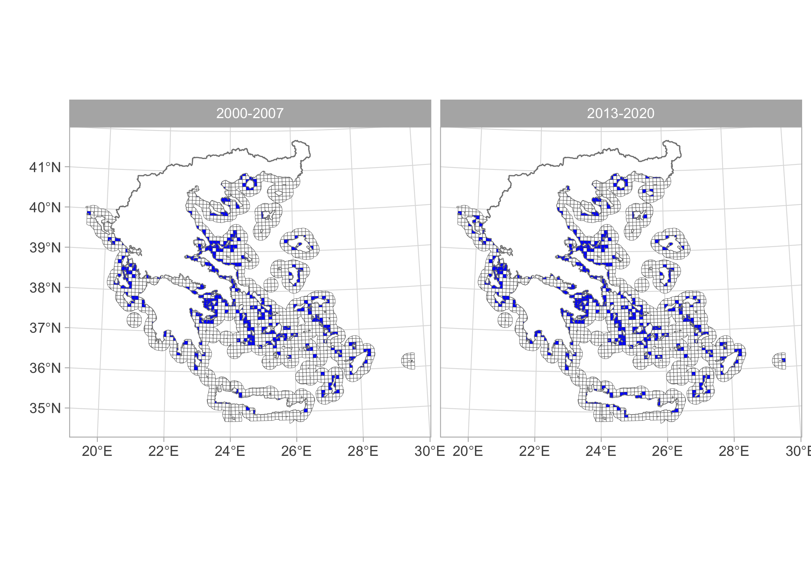<!-- -->

```r
ggsave(here::here("figures","map3.png"), dpi = 600)
```

<div data-pagedtable="false">
  <script data-pagedtable-source type="application/json">
{"columns":[{"label":["yearr"],"name":[1],"type":["chr"],"align":["left"]},{"label":["total_area"],"name":[2],"type":["dbl"],"align":["right"]},{"label":["geometry"],"name":[3],"type":["s_MULTIP"],"align":["right"]}],"data":[{"1":"2000-2007","2":"42288.94","3":"<s_MULTIP>"},{"1":"2013-2020","2":"44334.51","3":"<s_MULTIP>"}],"options":{"columns":{"min":{},"max":[10]},"rows":{"min":[10],"max":[10]},"pages":{}}}
  </script>
</div>


We'd also like to map the difference in occupancy probabilities.

```r
delta <- as.matrix(meanz[,2]/100 - meanz[,1]/100)
ring_occ2 <- ring_occ %>%
  filter(yearr == '2013-2020')
ggplot() + 
  geom_sf(data = greece, colour = "grey50", fill = "white") + 
  geom_sf(data = grid, colour = "grey50", fill = "white", lwd = 0.1) + 
  geom_sf(data = ring_occ2, lwd = 0.1, aes(fill = delta)) + 
  geom_sf(data = greece, colour = "grey50", fill = "white",lwd = 0.2) + 
  scale_fill_gradientn(colours = RColorBrewer::brewer.pal(11,"RdYlGn"),
                       name = '') + 
  labs(title = '') +
  xlab("") + ylab("") + 
  theme(legend.position = 'bottom', 
        legend.title = element_text(size=8), 
        legend.text = element_text(size=8),
        legend.key.size = unit(0.5, "cm"))
```

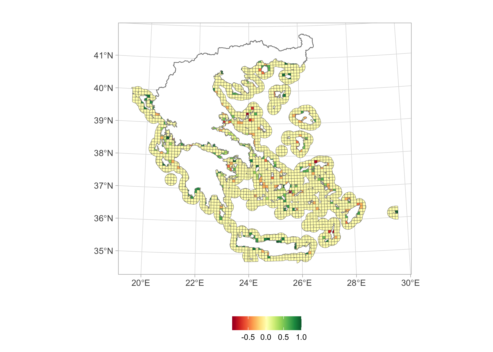<!-- -->

```r
ggsave(here::here("figures","map4.png"), dpi = 600)
```

# Intersect with protected areas


```r
pa <- st_read(here::here("shapefiles","N2000_v31_marine_WGS84.shp"))
```

```
## Reading layer `N2000_v31_marine_WGS84' from data source 
##   `/Users/oliviergimenez/Dropbox/OG/GITHUB/monkseal-occupancy/shapefiles/N2000_v31_marine_WGS84.shp' 
##   using driver `ESRI Shapefile'
## Simple feature collection with 174 features and 5 fields
## Geometry type: MULTIPOLYGON
## Dimension:     XY
## Bounding box:  xmin: 19.35198 ymin: 34.79367 xmax: 29.64895 ymax: 41.25424
## Geodetic CRS:  WGS 84
```

```r
pa <- st_transform(pa,2100)
sum(rapply(st_geometry(pa), nrow))
```

```
## [1] 954842
```

```r
pa <- st_simplify(pa,dTolerance=50)
sum(rapply(st_geometry(pa), nrow))
```

```
## [1] 43195
```

```r
pa %>% 
  mutate(area = st_area(.),
         areakm2 = units::set_units(area, km^2)) %>%
  summarize(total = sum(areakm2))
```

<div data-pagedtable="false">
  <script data-pagedtable-source type="application/json">
{"columns":[{"label":[""],"name":["_rn_"],"type":[""],"align":["left"]},{"label":["total"],"name":[1],"type":["units"],"align":["right"]},{"label":["geometry"],"name":[2],"type":["s_MULTIP"],"align":["right"]}],"data":[{"1":"34333.92 [km^2]","2":"<s_MULTIP>","_rn_":"1"}],"options":{"columns":{"min":{},"max":[10]},"rows":{"min":[10],"max":[10]},"pages":{}}}
  </script>
</div>

Let's have a look to the map of marine protected areas:

```r
ggplot() + 
  geom_sf(data = greece, colour = "grey50", fill = "grey50") + 
  geom_sf(data = pa, colour = "red", fill = "transparent", lwd = 0.1) 
```

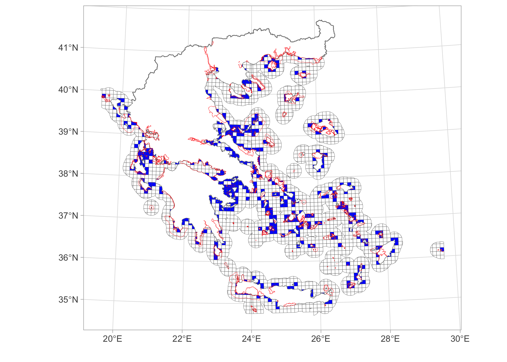<!-- -->

```r
ggsave(here::here("figures","mpa.png"), dpi = 600)
```

Look at where the high probability of presence on monk seals pups coincides with marine protected areas, for the period 2013-2020.

```r
ggplot() + 
  geom_sf(data = greece, colour = "grey50", fill = "white") + 
  geom_sf(data = ring_occ2, lwd = 0.1, aes(fill = z_occupied)) +
  geom_sf(data = greece, colour = "grey50", fill = "white",lwd = 0.2) + 
    scale_fill_manual(values = c('white','blue'),
                    name = "Site is") + 
  geom_sf(data = pa, colour = "red", fill = "transparent", lwd = 0.1) +
  xlab("") + ylab("") +
  theme(legend.position = "none")
```

<!-- -->

```r
ggsave(here::here("figures","mpamonkseals.png"), dpi = 600)
```

Out of the total number of cells with high probability of occurrence of monk seals, this number intersects with marine protected areas.

```r
mask <- ring_occ %>%
  filter(z_occupied == 'used') %>%
  filter(yearr == '2013-2020') %>%
  st_intersects(pa) %>%
  lengths > 0
sum(mask)
```

```
## [1] 299
```

```r
ring_occ2$map <- ring_occ2$z_occupied
mask2 <- (ring_occ2$map == 'used')
ring_occ2$map[mask2][mask] <- 'used, overlap w/ mpa'
ring_occ2$map[mask2][!mask] <- 'used, no overlap w/ mpa'
```

On a map, this gives.

```r
ggplot() + 
  geom_sf(data = greece, colour = "grey50", fill = "white") + 
  geom_sf(data = ring_occ2, lwd = 0.1, aes(fill = map)) +
  geom_sf(data = greece, colour = "grey50", fill = "white",lwd = 0.2) + 
    scale_fill_manual(values = c('white','blue','red'),
                    name = "Site is") + 
  geom_sf(data = pa, colour = "red", fill = "transparent", lwd = 0.1) +
  xlab("") + ylab("") +
  theme(legend.position = "bottom")
```

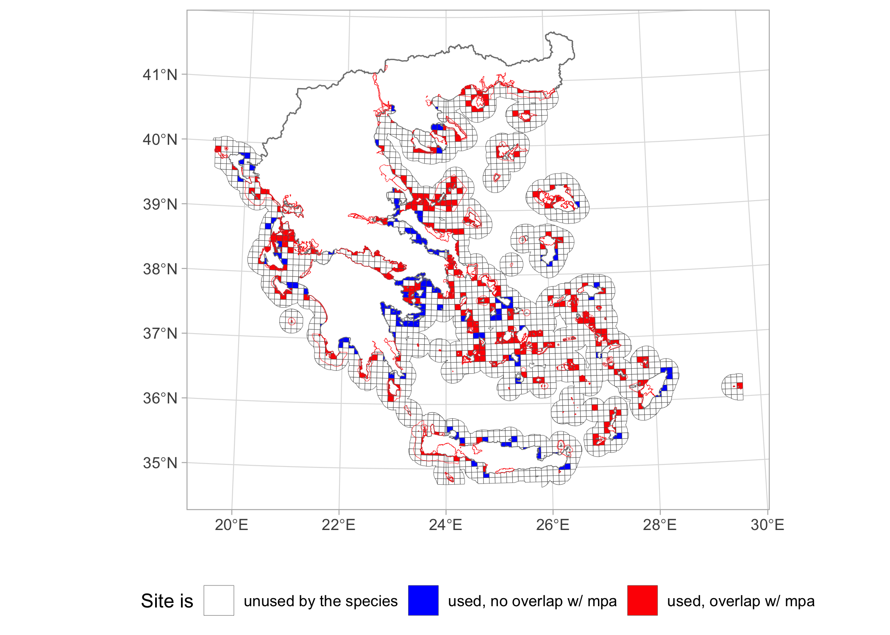<!-- -->

```r
ggsave(here::here("figures","mpamonksealsdetails.png"), dpi = 600)
```


# Focus on pups

We do the same analyses with pups.


```r
monkseal <- monkseal %>%
  filter(stage=='PUP0' | stage=='PUP1' | stage=='PUP2' | stage=='PUP3' | stage=='PUP4')
```

The number of sightings.

```r
monkseal %>% 
  ggplot() +
  aes(x = year) + 
  geom_bar()
```

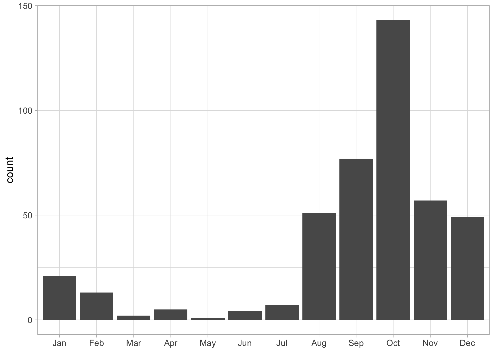<!-- -->

The sightings are done along the year (all years are pooled together). October gets maximum sightings.

```r
monkseal %>% 
  ggplot() +
  aes(x = factor(month)) + 
  geom_bar() + 
  labs(x = NULL)
```

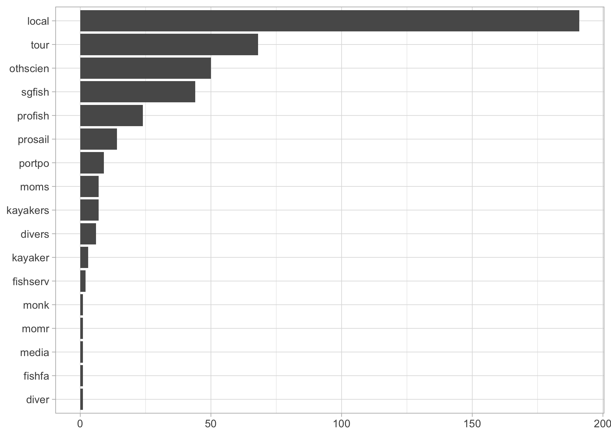<!-- -->

Regarding the observers, we see that the sightings are mostly done by local people, then to a lesser extent tourists, and a few others. 

```r
monkseal %>% 
  filter(!is.na(observer)) %>%
  count(observer) %>%
  ggplot() +
  aes(x = n, y = fct_reorder(observer, n)) %>%
  geom_col() +
  labs(y = NULL, x = NULL)
```

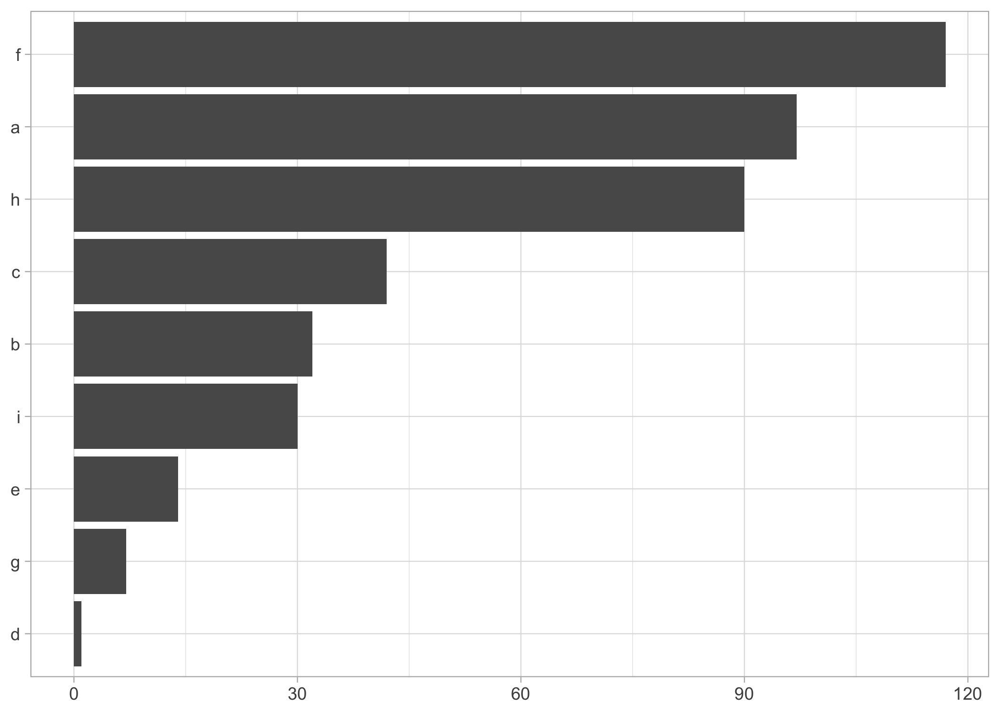<!-- -->

Last, regarding where the seals were when they were spotted, we see that the sightings are mostly on beach (f). 

```r
monkseal %>% 
  filter(!is.na(where)) %>%
  count(where) %>%
  ggplot() +
  aes(x = n, y = fct_reorder(where, n)) %>%
  geom_col() +
  labs(y = NULL, x = NULL)
```

<!-- -->

Map counts.

```r
counts <- monkseal %>%
  group_by(utm) %>%
  count()
names(counts) <- c('UTM_NAME','val')
grid_wcounts <- right_join(grid, counts)
classes <- classInt::classIntervals(grid_wcounts$val, n = 3, style = "jenks")
bwr <- grDevices::colorRampPalette(rev(c('red', 'orange', 'yellow', 'cyan', 'blue')))
grid_wcounts <- grid_wcounts %>%
  mutate(valdiscrete = cut(val, classes$brks, include.lowest = T))
ggplot() + 
  geom_sf(data = greece, colour = "grey50", fill = "white") + 
  geom_sf(data = grid, colour = "grey50", fill = "white", lwd = 0.1) + 
  geom_sf(data = grid_wcounts, lwd = 0.1, aes(fill = valdiscrete)) + 
  geom_sf(data = greece, colour = "grey50", fill = "white",lwd = 0.2) + 
  scale_fill_manual(
    name = 'counts',
    values = bwr(5),
    guide = guide_legend(reverse = TRUE)) + 
  labs(title = '', x = NULL, y = NULL)
```

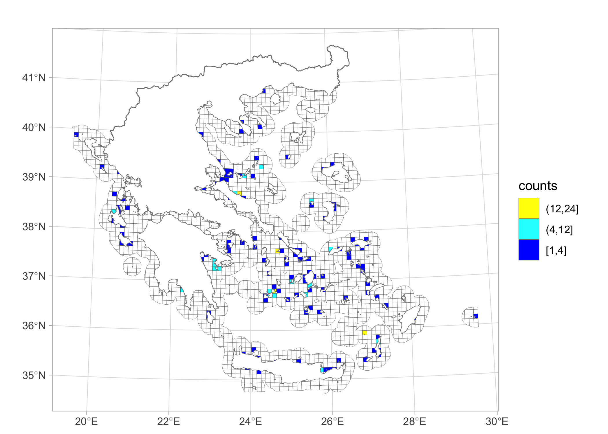<!-- -->

```r
ggsave(here::here("figures","map1pups.png"),dpi=600)
```

Format data for occupancy analyses.

```r
mm <- c('Sep','Oct','Nov','Dec','Jan') # extract data
indyear <- c(2000:2007,2013:2020)
ids <- unique(grid$UTM_NAME)
mom_detections <- list()
for (k in 1:length(indyear)){
  mom_detections[[k]] <- matrix(0,nrow=length(ids),ncol=length(mm))
  data <- filter(monkseal,year==indyear[k])
  ind <- 1
  for (i in mm){
    temp <- filter(data, month==i)
    utm_temp <- unique(temp$utm)
    for (j in utm_temp){
      # 1 if a sighting was made in square j in month i
      mom_detections[[k]][ids==j,ind] <- 1
    }
    ind <- ind + 1
  }
}
mom_det <- do.call(cbind, mom_detections) # bind data from all year in columns
# convert the occupancy dataset in a 3D array:
y <- list()
ind <- 0
for (i in 1:length(indyear)){
	mask <- (ind + i):(ind + i + length(mm) - 1)
	y[[i]] <- mom_det[,mask]
	ind <- ind + length(mm) - 1
}

# convert list into array (https://stackoverflow.com/questions/37433509/convert-list-to-a-matrix-or-array)
y <- array(unlist(y), dim = c(nrow(y[[1]]), ncol(y[[1]]), length(y)))
dim(y)
```

```
## [1] 2850    5   16
```

```r
new_y <- NULL
for (i in 1:dim(y)[3]){ # loop over years
  new_y <- cbind(new_y,apply(y[,1:5,i],1,sum))
}
new_y <- (new_y > 0) 
y1 <- apply(new_y[,1:8],1,sum)
y2 <- apply(new_y[,9:16],1,sum)
y <- cbind(y1,y2)
dim(y)
```

```
## [1] 2850    2
```

```r
range(y)
```

```
## [1] 0 5
```

Load `nimble` package:

```r
library(nimble)
```

We specify our model:

```r
model <- nimbleCode({

  # occupancy
  mupsi ~ dnorm(-5,sd = 1)
  for(i in 1:nsite){
    cloglog(psi[i]) <- mupsi + offset[i]
  }

  # detection
  sdp ~ dunif(0,10)
  for(i in 1:nyear){
    muptemp[i] ~ dunif(0,1)
    logit(mup[i]) <- muptemp[i]
  }
  for(i in 1:nsite){
    lp[i] ~ dnorm(0, sd = sdp)
    for(t in 1:nyear){
      logit(p[i,t]) <- mup[t] + lp[i]
    }
  }
  
  # priors for mean extinction/colonization
  mueps ~ dnorm(-5, sd = 1)
  mugam ~ dnorm(-5, sd = 1)
  
  # process model
  for(i in 1:nsite){
    z[i,1] ~ dbern(psi[i])
    cloglog(gamma[i]) <- mugam + offset[i]
    cloglog(eps[i]) <- mueps + offset[i]
    z[i,2] ~ dbern(z[i,1] * (1 - eps[i]) + (1 - z[i,1]) * gamma[i])
  }
  
  # observation model
  for (i in 1:nsite){
    for (k in 1:nyear){
      y[i,k] ~ dbin(z[i,k] * p[i,k],5)
    }
  }
})
```

Specify data, initial values, parameters to be monitored and various MCMC details:

```r
# data
offset <- log(as.numeric(grid$areakm2))
win.data <- list(y = y)
win.constants <- list(nsite = dim(y)[1], 
                      nyear = dim(y)[2], 
                      offset = offset)

# initial values
zst <- cbind(as.numeric(y1 > 0), as.numeric(y2 > 0)) # observed occurrence as inits for z 
inits <- function() {list(z = zst, 
                          mueps = -4, 
                          mugam = -4, 
                          mupsi = -4,
                          sdp = runif(1,1,9), 
                          muptemp = rep(0,dim(y)[1]),
                          eps = rep(0.5,dim(y)[1]),
                          gamma = rep(0.5,dim(y)[1]),
                          psi = rep(0.5,dim(y)[1]),
                          lp = rep(0,dim(y)[1]),
                          mup = rep(0,dim(y)[2]))}

# MCMC settings
ni <- 15000
nb <- 5000
nc <- 2
```

Create model as a R object: 

```r
survival <- nimbleModel(code = model,
                        data = win.data,
                        constants = win.constants,
                        inits = inits(),
                        calculate = FALSE)
#survival$initializeInfo()
#survival$calculate()
```

Go through `nimble` workflow:

```r
# compile model
Csurvival <- compileNimble(survival)

# create a MCMC configuration
survivalConf <- configureMCMC(survival, 
                              useConjugacy = FALSE)
```

```
## ===== Monitors =====
## thin = 1: mupsi, sdp, muptemp, mueps, mugam
## ===== Samplers =====
## RW sampler (2856)
##   - mupsi
##   - sdp
##   - muptemp[]  (2 elements)
##   - mueps
##   - mugam
##   - lp[]  (2850 elements)
## binary sampler (5700)
##   - z[]  (5700 elements)
```

```r
# replace RW samplers by slice sampler for standard deviation of random effects on detection
survivalConf$removeSamplers(c('sdp'))
survivalConf$addSampler(target = c('sdp'),
                        type = 'slice')

# add some parameters to monitor
survivalConf$addMonitors(c("lp","z","mupsi","mup"))
```

```
## thin = 1: mupsi, sdp, muptemp, mueps, mugam, lp, z, mup
```

```r
# create MCMC function and compile it
survivalMCMC <- buildMCMC(survivalConf)
CsurvivalMCMC <- compileNimble(survivalMCMC, project = survival)
```

Run `nimble`:

```r
ptm <- proc.time()
out <- runMCMC(mcmc = CsurvivalMCMC,
               niter = ni,
               nburnin = nb,
               nchains = nc)
```

```
## |-------------|-------------|-------------|-------------|
## |-------------------------------------------------------|
## |-------------|-------------|-------------|-------------|
## |-------------------------------------------------------|
```

```r
x <- proc.time() -  ptm
save(out, x, file = here::here("models","monksealscloglogpups-nimble.RData"))
```

The code above takes some time to run. I ran it, saved the results and use them from here:

```r
load(here::here("models","monksealscloglogpups-nimble.RData"))
out_backup <- out
```

Check convergence:

```r
library(MCMCvis)
MCMCtrace(object = out,
          pdf = FALSE,
          ind = TRUE,
          Rhat = TRUE, # add Rhat
          n.eff = TRUE, # add eff sample size
          params = c("mupsi","sdp",
                     "mup","mugam","mueps"))
```

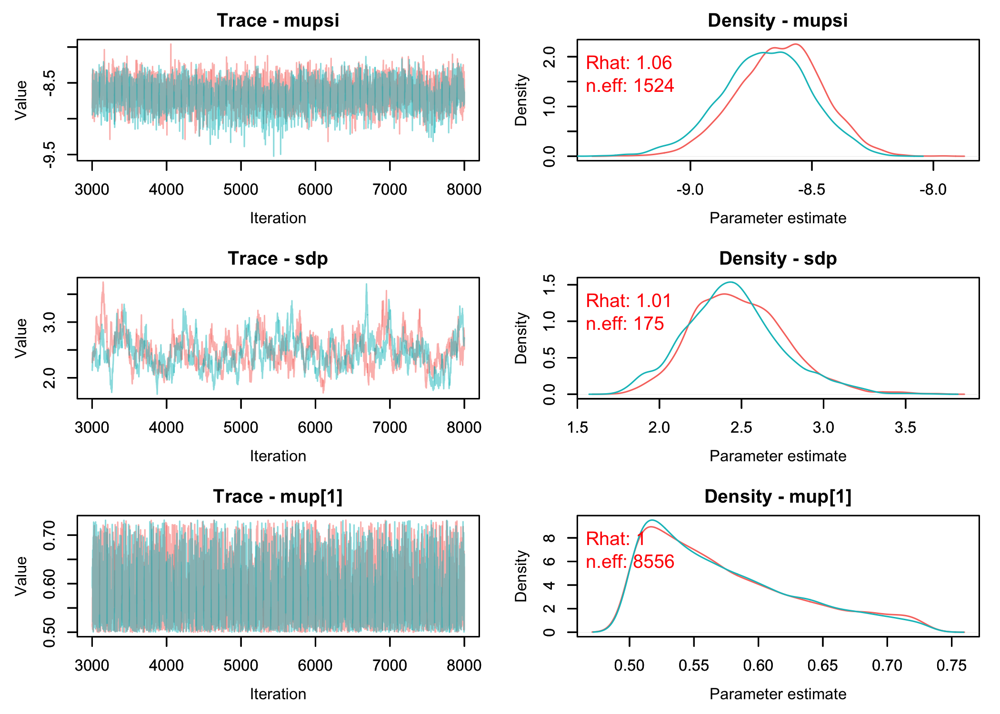<!-- -->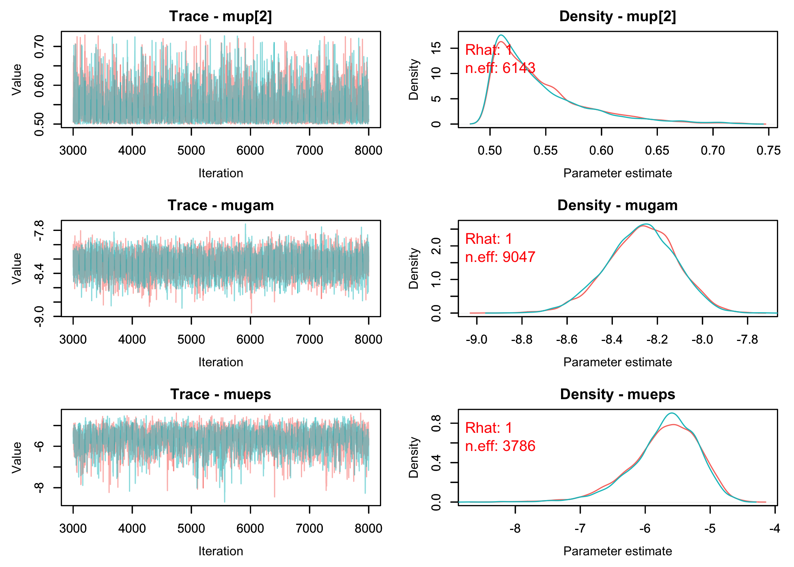<!-- -->

Print results:

```r
out <- rbind(out$chain1, out$chain2)
out %>%
  as_tibble() %>%
  pivot_longer(cols = everything(),  values_to = "value", names_to = "parameter") %>%
  filter(str_detect(parameter, "mu") | str_detect(parameter, "sd")) %>%
  filter(str_detect(parameter, "muptemp", negate = TRUE)) %>%
  group_by(parameter) %>%
  summarize(median = median(value),
            lci = quantile(value, probs = 2.5/100),
            uci = quantile(value, probs = 97.5/100))
```

<div data-pagedtable="false">
  <script data-pagedtable-source type="application/json">
{"columns":[{"label":["parameter"],"name":[1],"type":["chr"],"align":["left"]},{"label":["median"],"name":[2],"type":["dbl"],"align":["right"]},{"label":["lci"],"name":[3],"type":["dbl"],"align":["right"]},{"label":["uci"],"name":[4],"type":["dbl"],"align":["right"]}],"data":[{"1":"mueps","2":"-5.5482341","3":"-6.6856918","4":"-4.8072521"},{"1":"mugam","2":"-8.2585233","3":"-8.5713134","4":"-7.9751905"},{"1":"mup[1]","2":"0.5588832","3":"0.5027983","4":"0.7128727"},{"1":"mup[2]","2":"0.5287616","3":"0.5011437","4":"0.6519960"},{"1":"mupsi","2":"-8.6241512","3":"-8.9971138","4":"-8.2885725"},{"1":"sdp","2":"2.3675738","3":"1.9000035","4":"3.0187407"}],"options":{"columns":{"min":{},"max":[10]},"rows":{"min":[10],"max":[10]},"pages":{}}}
  </script>
</div>

Check out the number of occupied UTM squares by the species over time. First work out the naive occupancy, that is the number of sites that were observed occupied over the two periods:

```r
naiveocc <- rep(NA,2) 
for (i in 1:2){
  naiveocc[i] <- sum(y[,i]>0)
}
naiveocc
```

```
## [1] 30 68
```

Now the estimated occupancy:

```r
zzz <- out[,grepl("z", colnames(out))]
zz <- array(NA, dim = c(nrow(zzz), ncol(zzz)/2, 2))
zz[,,1] <- zzz[1:nrow(zzz),1:(ncol(zzz)/2)]
zz[,,2] <- zzz[1:nrow(zzz),(ncol(zzz)/2+1):ncol(zzz)]
dim(zz) # 2000 x 2850 x 2 (nbMCMC x nSquares x nyears)
```

```
## [1] 20000  2850     2
```

```r
nbpixocc <- apply(zz,c(1,3),sum) # 2000 x 2
meannbpixocc <- apply(nbpixocc,2,median)
sdnbpixocc <- apply(nbpixocc,2,sd)
qulnbpixocc <- apply(nbpixocc,2,quantile,probs=2.5/100)
quunbpixocc <- apply(nbpixocc,2,quantile,probs=97.5/100)
```

Put everything together:

```r
occupancy <- data.frame(period = c(1,2),
  naiveocc = naiveocc, 
  medianocc = meannbpixocc,
  qulnbpixocc = qulnbpixocc,
  quunbpixocc = quunbpixocc)
occupancy2 <- data.frame(period = rep(c(1,2),2),
  occ = c(occupancy$naiveocc, occupancy$medianocc), 
  quantlower = c(rep(NA,2),occupancy$qulnbpixocc),
  quantupper = c(rep(NA,2), occupancy$quunbpixocc),
  Occupancy = c(rep('naive',2),rep('estimated',2)))
occupancy2
```

<div data-pagedtable="false">
  <script data-pagedtable-source type="application/json">
{"columns":[{"label":["period"],"name":[1],"type":["dbl"],"align":["right"]},{"label":["occ"],"name":[2],"type":["dbl"],"align":["right"]},{"label":["quantlower"],"name":[3],"type":["dbl"],"align":["right"]},{"label":["quantupper"],"name":[4],"type":["dbl"],"align":["right"]},{"label":["Occupancy"],"name":[5],"type":["chr"],"align":["left"]}],"data":[{"1":"1","2":"30","3":"NA","4":"NA","5":"naive"},{"1":"2","2":"68","3":"NA","4":"NA","5":"naive"},{"1":"1","2":"42","3":"34","4":"52","5":"estimated"},{"1":"2","2":"89","3":"79","4":"103","5":"estimated"}],"options":{"columns":{"min":{},"max":[10]},"rows":{"min":[10],"max":[10]},"pages":{}}}
  </script>
</div>

Now plot:

```r
occupancy2 %>% 
  ggplot() + 
  aes(x = period, y =  occ, group = Occupancy, linetype = Occupancy) + 
    geom_ribbon(data=occupancy2,aes(ymin=quantlower,ymax=quantupper),alpha=0.1, show.legend = FALSE) + 
 geom_line() +
  scale_linetype_manual(values=c("solid", "dashed")) +  
  geom_point() + 
  xlab('Year') + 
  ylab('Number of occupied sites')
```

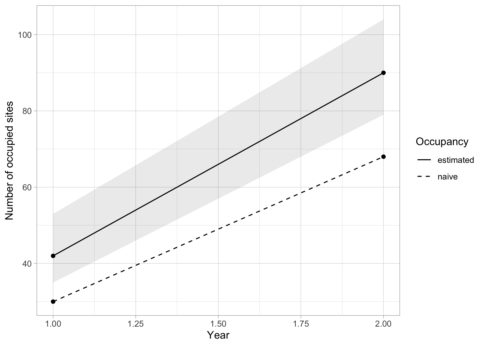<!-- -->

Now display local extinction, colonization and species detection probabilities estimates with credible intervals:

```r
epsmean <- icloglog(mean(out[,'mueps']) + mean(offset))
epsql <- icloglog(mean(out[,'mueps']) + mean(offset) - 2*sd(out[,'mueps']))
epsqu <- icloglog(mean(out[,'mueps']) + mean(offset) + 2*sd(out[,'mueps']))

gammean <- icloglog(mean(out[,'mugam']) + mean(offset))
gamql <- icloglog(mean(out[,'mugam']) + mean(offset) - 2*sd(out[,'mugam']))
gamqu <- icloglog(mean(out[,'mugam']) + mean(offset) + 2*sd(out[,'mugam']))

pmean1 <- plogis(mean(out[,'mup[1]']))
pmean2 <- plogis(mean(out[,'mup[2]']))
pqu1 <- plogis(mean(out[,'mup[1]']) + 2*sd(out[,'mup[1]']))
pql1 <- plogis(mean(out[,'mup[1]']) - 2*sd(out[,'mup[1]']))
pqu2 <- plogis(mean(out[,'mup[2]']) + 2*sd(out[,'mup[2]']))
pql2 <- plogis(mean(out[,'mup[2]']) - 2*sd(out[,'mup[2]']))

eps <- data.frame(
  param = epsmean, 
  qlo = epsql,
  qup = epsqu)

gam <- data.frame(
  param = gammean, 
  qlo = gamql,
  qup = gamqu)

det <- data.frame(period = c(1,2),
  param = c(pmean1,pmean2),
  qlo = c(pql1,pql2),
  qup = c(pqu1,pqu2))

eps
```

<div data-pagedtable="false">
  <script data-pagedtable-source type="application/json">
{"columns":[{"label":["param"],"name":[1],"type":["dbl"],"align":["right"]},{"label":["qlo"],"name":[2],"type":["dbl"],"align":["right"]},{"label":["qup"],"name":[3],"type":["dbl"],"align":["right"]}],"data":[{"1":"0.2625761","2":"0.109241","3":"0.5515691"}],"options":{"columns":{"min":{},"max":[10]},"rows":{"min":[10],"max":[10]},"pages":{}}}
  </script>
</div>

```r
gam
```

<div data-pagedtable="false">
  <script data-pagedtable-source type="application/json">
{"columns":[{"label":["param"],"name":[1],"type":["dbl"],"align":["right"]},{"label":["qlo"],"name":[2],"type":["dbl"],"align":["right"]},{"label":["qup"],"name":[3],"type":["dbl"],"align":["right"]}],"data":[{"1":"0.02106307","2":"0.01564776","3":"0.02832534"}],"options":{"columns":{"min":{},"max":[10]},"rows":{"min":[10],"max":[10]},"pages":{}}}
  </script>
</div>

```r
det
```

<div data-pagedtable="false">
  <script data-pagedtable-source type="application/json">
{"columns":[{"label":["period"],"name":[1],"type":["dbl"],"align":["right"]},{"label":["param"],"name":[2],"type":["dbl"],"align":["right"]},{"label":["qlo"],"name":[3],"type":["dbl"],"align":["right"]},{"label":["qup"],"name":[4],"type":["dbl"],"align":["right"]}],"data":[{"1":"1","2":"0.6397102","3":"0.6119784","4":"0.6665399"},{"1":"2","2":"0.6322098","3":"0.6132193","4":"0.6507989"}],"options":{"columns":{"min":{},"max":[10]},"rows":{"min":[10],"max":[10]},"pages":{}}}
  </script>
</div>

Let's map the estimated distribution of monk seals. First, compute realized occupancy per site and per period, and put altogether in a big table:

```r
zzz <- out[,grepl("z", colnames(out))]
zz <- array(NA, dim = c(nrow(zzz), ncol(zzz)/2, 2))
zz[,,1] <- zzz[1:nrow(zzz),1:(ncol(zzz)/2)]
zz[,,2] <- zzz[1:nrow(zzz),(ncol(zzz)/2+1):ncol(zzz)]
meanz <- apply(zz,c(2,3),mean)
dim(meanz)
```

```
## [1] 2850    2
```

```r
toplot <- data.frame(
  meanz = c(meanz[,c(1,2)]), 
  UTM_NAME = rep(unique(grid$UTM_NAME),2), 
  yearr = c(rep('2000-2007',nrow(meanz)), rep('2013-2020',nrow(meanz)))) 
ring_occ <- left_join(grid,toplot)
```


```r
nrow(meanz)
```

```
## [1] 2850
```

```r
sum(meanz[,2] == meanz[,1])
```

```
## [1] 12
```

```r
sum(meanz[,2] > meanz[,1])
```

```
## [1] 2820
```

```r
sum(meanz[,2] < meanz[,1])
```

```
## [1] 18
```

Then, plot two maps, one for each multi-year period:

```r
ggplot() + 
  geom_sf(data = greece, colour = "grey50", fill = "white") + 
  geom_sf(data = grid, colour = "grey50", fill = "white", lwd = 0.1) + 
  geom_sf(data = ring_occ, lwd = 0.1, aes(fill = as.numeric(meanz))) + 
  geom_sf(data = greece, colour = "grey50", fill = "white",lwd = 0.2) + 
  scale_fill_viridis(
    name = 'Pr(occupancy)', 
    direction = -1,
    alpha = 0.7) + 
  labs(title = '', x = NULL, y = NULL) +
  facet_wrap(~ yearr, ncol = 2) + 
  theme(legend.position = 'bottom', 
        legend.title = element_text(size=8), 
        legend.text = element_text(size=8),
        legend.key.size = unit(0.5, "cm"))
```

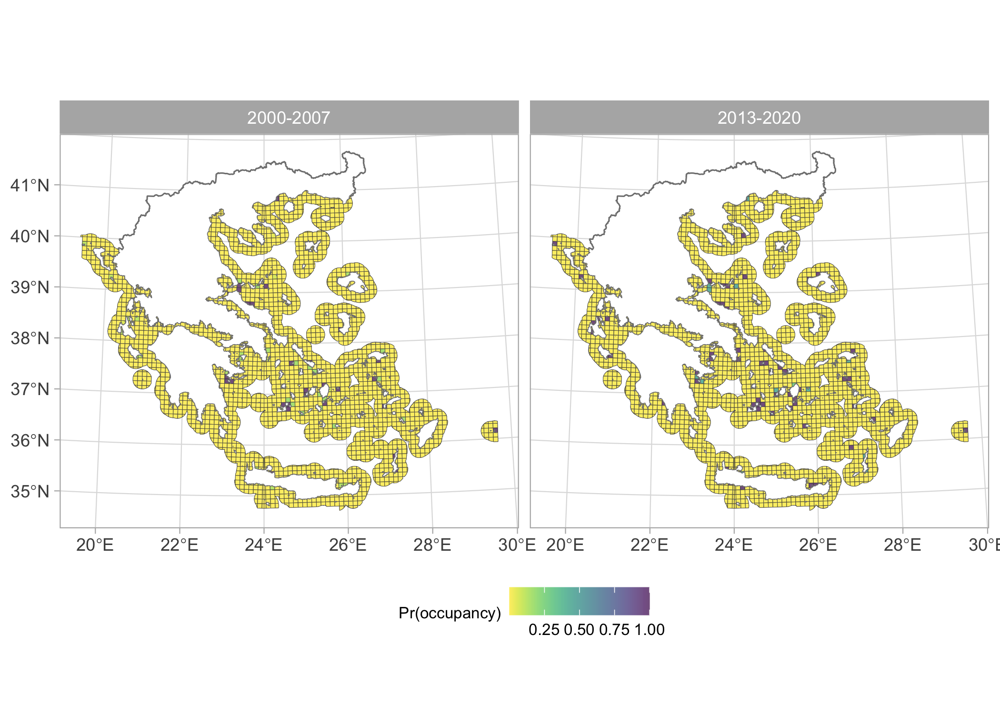<!-- -->

```r
ggsave(here::here("figures","map2pups.png"),dpi=600)
```

We'd also like to have two maps of the estimated occupied sites for the two periods. To do so, we say that all squares with prob of occupancy greater than $25\%$ are occupied. This gives the following maps: 

```r
zzz <- out[,grepl("z", colnames(out))]
zz <- array(NA, dim = c(nrow(zzz), ncol(zzz)/2, 2))
zz[,,1] <- zzz[1:nrow(zzz),1:(ncol(zzz)/2)]
zz[,,2] <- zzz[1:nrow(zzz),(ncol(zzz)/2+1):ncol(zzz)]
sumz <- apply(zz,c(2,3),sum)
meanz <- apply(zz,c(2,3),sum)/dim(zz)[1]*100
z_occupied <- (meanz > 25) # 
toplot <- data.frame(
  z_occupied = c(z_occupied[,c(1,2)]), 
  UTM_NAME = rep(unique(grid$UTM_NAME),2), 
  yearr = c(rep('2000-2007',nrow(z_occupied)), rep('2013-2020',nrow(z_occupied)))) 
ring_occ <- left_join(grid,toplot) %>%
  mutate(z_occupied = if_else(z_occupied == TRUE, 'used', 'unused by the species'))

ggplot() + 
  geom_sf(data = greece, colour = "grey50", fill = "white") + 
  geom_sf(data = ring_occ, lwd = 0.1, aes(fill = z_occupied)) + 
    geom_sf(data = greece, colour = "grey50", fill = "white",lwd = 0.2) + 
    scale_fill_manual(values = c('white','blue'),
                    name = "Site is") + 
  labs(x = NULL, y = NULL) +
  facet_wrap(~ yearr, ncol = 2) + 
  theme(legend.position = "none")
```

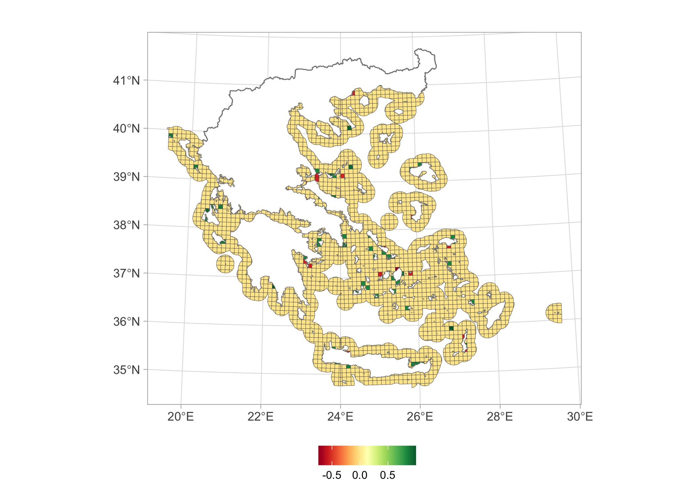<!-- -->

```r
ggsave(here::here("figures","map3pups.png"),dpi=600)
```

<div data-pagedtable="false">
  <script data-pagedtable-source type="application/json">
{"columns":[{"label":["yearr"],"name":[1],"type":["chr"],"align":["left"]},{"label":["total_area"],"name":[2],"type":["dbl"],"align":["right"]},{"label":["geometry"],"name":[3],"type":["s_MULTIP"],"align":["right"]}],"data":[{"1":"2000-2007","2":"2992.977","3":"<s_MULTIP>"},{"1":"2013-2020","2":"8431.928","3":"<s_MULTIP>"}],"options":{"columns":{"min":{},"max":[10]},"rows":{"min":[10],"max":[10]},"pages":{}}}
  </script>
</div>

We'd like to consider the difference in occupancy probabilities.

```r
delta <- as.matrix(meanz[,2]/100 - meanz[,1]/100)
ring_occ2 <- ring_occ %>%
  filter(yearr == '2013-2020')
ggplot() + 
  geom_sf(data = greece, colour = "grey50", fill = "white") + 
  geom_sf(data = grid, colour = "grey50", fill = "white", lwd = 0.1) + 
  geom_sf(data = ring_occ2, lwd = 0.1, aes(fill = delta)) + 
  geom_sf(data = greece, colour = "grey50", fill = "white",lwd = 0.2) + 
  scale_fill_gradientn(colours = RColorBrewer::brewer.pal(15,"RdYlGn"),
                       name = '') + 
  labs(title = '', x = NULL, y = NULL) + 
  theme(legend.position = 'bottom', 
        legend.title = element_text(size=8), 
        legend.text = element_text(size=8),
        legend.key.size = unit(0.5, "cm"))
```

<!-- -->

```r
ggsave(here::here("figures","map4pups.png"),dpi=600)
```

Look at where the high probability of presence on monk seals pups coincides with marine protected areas, for the period 2013-2020.

```r
ggplot() + 
  geom_sf(data = greece, colour = "grey50", fill = "white") + 
  geom_sf(data = ring_occ2, lwd = 0.1, aes(fill = z_occupied)) +
  geom_sf(data = greece, colour = "grey50", fill = "white",lwd = 0.2) + 
    scale_fill_manual(values = c('white','blue'),
                    name = "Site is") + 
  geom_sf(data = pa, colour = "red", fill = "transparent", lwd = 0.1) +
  xlab("") + ylab("") +
  theme(legend.position = "none")
```

<!-- -->

```r
ggsave(here::here("figures","mpamonksealspups.png"),dpi=600)
```

Out of the total number of cells with high probability of occurrence of monk seals pups, this number intersects with marine protected areas.

```r
mask <- ring_occ %>%
  filter(z_occupied == 'used') %>%
  filter(yearr == '2013-2020') %>%
  st_intersects(pa) %>%
  lengths > 0
sum(mask)
```

```
## [1] 62
```

```r
ring_occ2$map <- ring_occ2$z_occupied
mask2 <- (ring_occ2$map == 'used')
ring_occ2$map[mask2][mask] <- 'used, overlap w/ mpa'
ring_occ2$map[mask2][!mask] <- 'used, no overlap w/ mpa'
```

On a map, this gives.

```r
ggplot() + 
  geom_sf(data = greece, colour = "grey50", fill = "white") + 
  geom_sf(data = ring_occ2, lwd = 0.1, aes(fill = map)) +
  geom_sf(data = greece, colour = "grey50", fill = "white",lwd = 0.2) + 
    scale_fill_manual(values = c('white','blue','red'),
                    name = "Site is") + 
  geom_sf(data = pa, colour = "red", fill = "transparent", lwd = 0.1) +
  xlab("") + ylab("") +
  theme(legend.position = "bottom")
```

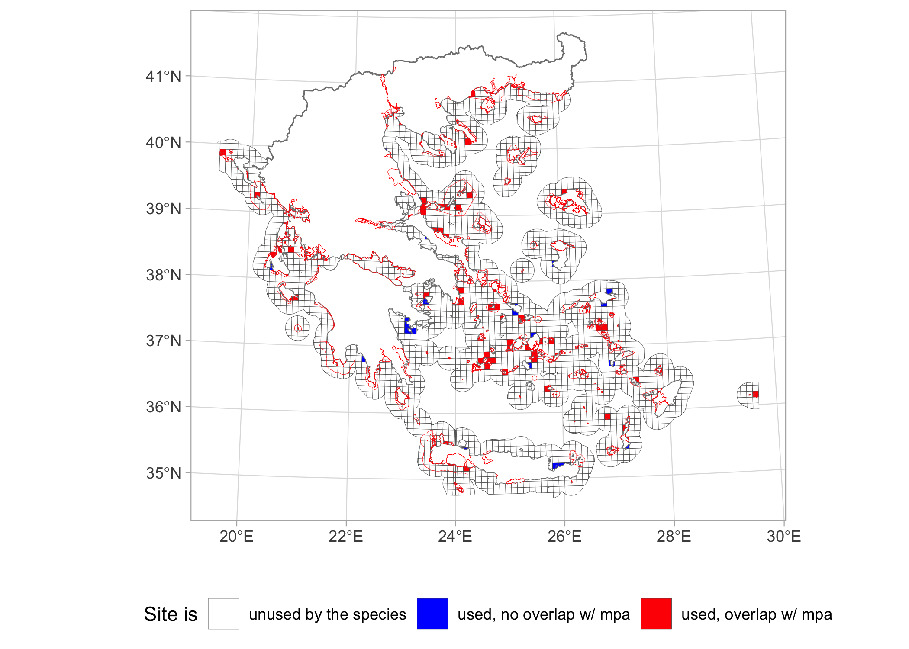<!-- -->

```r
ggsave(here::here("figures","mpamonksealsdetailspups.png"),dpi=600)
```
